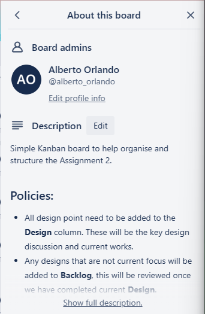
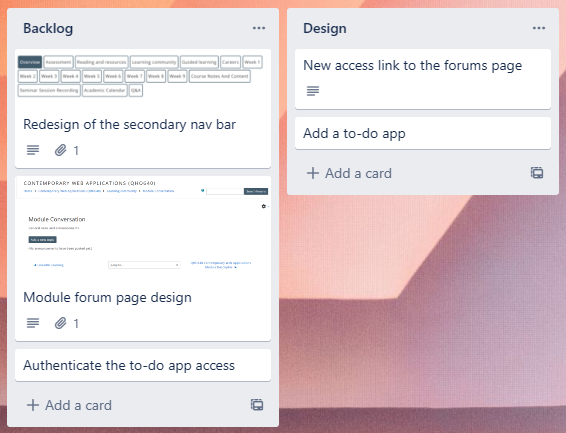

# Contemporary Web Application
## Assignment 2

Author: Alberto Orlando Mafla Prado

Web host site: [To-Do Application](https://todolist-crud-bbd52.web.app/)

Github: [To-Do Repository](https://github.com/A0M0305/todolist_app.git)

## Introduction

This is part 2 of the overall assignment set for this module.

In part 1 of the assignment we looked to UX research to find out what can be done to improve on the SOL page. The outcome of the research pointed to 2 directions.

1. User interaction
2. User organisation support

In point one a tool that is very useful is a forum. Yet this function was not made aware to the students, even as final year students this tool was not made aware to them. The reason for this was because this tool was well hidden in the maze of option provided on the nav bar.

In point 2 it was discovered that students, as users, have not developed in organisation and structure. A toll that would be created is a to-do list. As this is such a basic tool but mastering it can take years.

## Methodology

Based on what we found on part 1 of the assignment, having a deeper look at the type of methodology we concluded that the best approach is to use the agile method. Reason being the key principles of this method:
* Customer satisfaction: Delivering value to the customer is the primary goal.
* Iterative development: Projects are divided into smaller, manageable iterations, with each iteration delivering a working product incrementally.
* Adaptability: The project plan and deliverables can be adjusted as needed based on changing requirements or feedback.
* Continuous improvement: Teams regularly review and improve their processes and products to optimize efficiency and quality.

The primary key benefit of the Agile methodology is its flexibility. Unlike traditional project management methods, which often involve rigid plans and schedules, Agile methodology allows for changes and adjustments to be made throughout the project. This is particularly useful in software development, where requirements can change rapidly as the project progresses.

One of the downsides of this methodology is that it becomes challenging when managing the scope of works (SOWs). Because Agile methodology allows for changes and adjustments to be made throughout the project, it can be difficult to manage the scope of the project and ensure that it stays within the agreed-upon parameters. In this case we are not looking to build a core/new webpage, rather we are trying to figure out what we can do to improve. This can change throughout the project while investigations and testing goes on. Having this flexibility is a true key benefit.

As well as the agile methodology also has 2 frameworks to work with, SCRUM and KANBAN. For this project we looked at using kanban as this fits what we are after flexibility following the 4 key principles of kanban:
1. Visualization of the works,
2. Making the process policies explicit,
3. Manage Flow and
4. Limit work in progress.

## Methods

As part of the agile methodology we decided to go along with the kanban framework as this best suits the project type and it also suits our work-style.

Kanban Board: [SOL ReDesign](https://trello.com/invite/b/oYmTzJ80/ATTIcfb2e444d412106a21cde43b77f680e696962331/sol-redesign)

Looking at _Figure 1_, this is an overview of the kanban board we used during the project to help organise and see what steps we need to conduct. As part of the __4 principle of kanban__ this covers point 1 and point 2 were "Visuals" and "Making the process policies explicit".

As point 1 dictates visualization is a very powerful format and can make it easier to see how small or big the project looks. Using this can also help see who is currently working on what tasks, help spread out the work load and who is working harder than other.

As this is a solo project _Figure 2_ shows that the task have been assigned to "AO", if there were more developers working on this project you can also combine tasks and create collaborations for the tasks. To improve visualization you can also assign colors for each user, easier on the eye on who is working on what and as part of the [Trello](trello.com) tool you can filter by user etc.

Having a visual view of the project is useful but if there is no structure to this kanban framework can end up being a confusing view. As such this is where point 2 comes in where __making the process process policies explicit__ is important and set before the start of any kanban framework. There are several tools that can be used, for this project we have been using [Trello](trello.com) and the benefit of this tool is that we have an "About this board" section that allows us to see who is in this board and most importantly a section we can use to write out the policies for this board. Surprisingly this can be written down in Markdown format.

As per _Figure 3_ below are the policies set for this project kanban board.

#### Policies:

- All design point need to be added to the **Design** column. These  will be the key design discussion and current works.
- Any designs that are not current focus will be added to **Backlog**, this will be reviewed once we have completed current **Design**.
- From **Design** you can create the task that need to be completed on the **To Do** column. More tasks can be added throughout the project but must be related to **Design.**
- To move the task from **To Do** it must be assigned to a member who will take responsibility in completing this task. Once assigned this can be moved to **In Progress**.
- Once the task is completed from the **In Progress** column it can be moved to the **Completed** column for the project leader to review.
- Finally, once project leader has reviewed **Completed** tasks they can create what needs to be tested on the **Testing** column.

Following to point 3, __managing flow__, this is the responsibility of all members on this project,  but there would normally be a project leader that would take primary responsibility to ensure that tasks are flowing based on the set policies. As per _Figure 1_ our current Kanban table shows that we have followed our policies and update with tasks to ensure we completed the primary __Designs__.

Finally we look at point 4, __limit the work in progress__. We find that the key benefit of using the Agile with the Kanban framework is because of its flexibility and allowing us to view the project and adapt.

As per the policy placed, all designs and new design ideas are placed in the __Design__ column. From here it is decided which design idea would be the main focus. Based on the current work load, these ideas can be assigned and continued to the next steps or it can be put in the __Backlog__ column, as seen in _Figure 4_, so that the idea is not just discarded but in sight all all members to know that these are the future design developments to which when the work load drops these ideas can be brought forward to the __Design__ column to then start the new flow.

## Conclusion/Results

